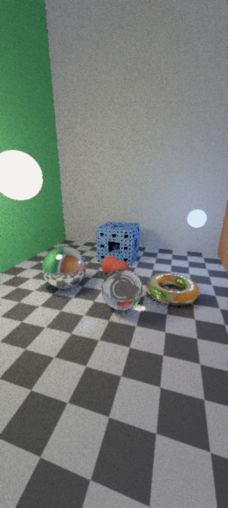
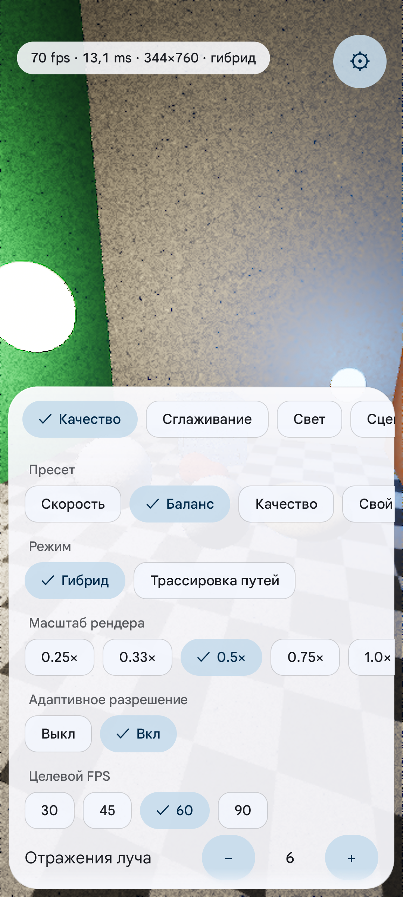
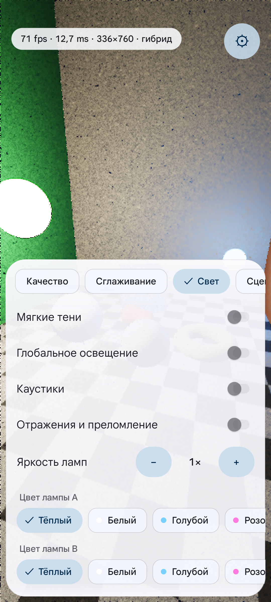

# Raytrace

**Русский** · [English](README.md)

Трассировщик лучей в реальном времени для Android. Сцена из полей расстояний (SDF): зеркальный и стеклянный шары, тор,
губка Менгера, две светящиеся лампы и шахматная комната. Рендер на GPU через **Rust + wgpu (Vulkan)**, затем
**временная репроекция** и **a-trous шумоподавление**; **адаптивное разрешение** держит целевую частоту кадров.
Интерфейс настроек в стиле Material 3 Expressive на базе [android-ui-kit](https://github.com/Xtratter/android-ui-kit).
Интерфейс двуязычный (русский и английский, по языку системы); скриншоты ниже сделаны на русском.

## Скриншоты

| Сцена (Баланс, камера неподвижна) | Вкладка «Качество» | Вкладка «Свет» |
|:---:|:---:|:---:|
|  |  |  |

## Возможности

- **Два режима**: *Гибрид* (один луч на пиксель с тенями, глобальным освещением, каустиками, отражениями и преломлением) и
  *Трассировка путей* (прогрессивная: при неподвижной камере изображение сходится к чистому)
- **Временная репроекция**: история переносится по предыдущей камере, проверяется по глубине, нормали и id материала,
  ограничивается диапазоном цветов соседей и смешивается по длине истории; субпиксельный джиттер (Хэлтон) даёт сглаживание
- **GI в половинном разрешении**: глобальное освещение считается отдельным проходом в половинном или четвертном разрешении, накапливается во времени, чистится a-trous и билатерально увеличивается до полного изображения
- **Тайминги проходов GPU** в режиме HUD «Полный» (если драйвер поддерживает timestamp-запросы)
- **A-trous шумоподавление**: 0-3 прохода с остановкой на границах (глубина, нормаль, яркость), края шахматки сохраняются
- **Защитный регулятор**: тяжёлые настройки (например, трассировка путей на 1.0x с большим числом сэмплов и отражений) автоматически упрощаются, если кадр длится дольше ~1.2 с, и медленно возвращаются
- **Адаптивное разрешение**: выберите целевой fps (30 / 45 / 60 / 90); масштаб рендера меняется от 0.25x до выбранного максимума
  с гистерезисом (не чаще раза в полсекунды)
- **Вывод**: апскейл Catmull-Rom, резкость, экспозиция, тонмаппинг (ACES / Рейнхард / нет), дизеринг
- **Пресеты**: Скорость, Баланс, Качество (и «Свой» после любого изменения)
- **Много переключателей**: мягкие тени, глобальное освещение, каустики, отражения и преломление, яркость и цвет ламп,
  анимация, авто-облёт, поле зрения, экспозиция, тонмаппинг, небо (день / сумерки / ночь)
- **Два режима камеры**: облёт (по умолчанию) и свободный полёт, управление касаниями или двумя экранными стиками геймпада
- **Интерфейс Material 3 Expressive** без ползунков: чипы, переключатели, степперы; темы (системная, светлая, тёмная, графит, AMOLED),
  вибрация, мягкие размытые края, островок статуса с fps / временем кадра / разрешением

## Управление

| Жест | Действие |
|---|---|
| Перетаскивание одним пальцем | Вращение камеры |
| Щипок | Масштаб |
| Левый стик | Движение (полёт) / масштаб (облёт); вверх = вперёд / приближение |
| Правый стик | Обзор (полёт) / вращение (облёт); вверх = взгляд вверх |
| Двойной тап | Сброс камеры |
| Кнопка-шестерёнка | Открыть настройки |
| Тап по островку статуса | Подробности HUD |

## Настройки

| Вкладка | Настройка | Значения |
|---|---|---|
| Качество | Пресет | Скорость / Баланс / Качество / Свой |
| | Режим | Гибрид / Трассировка путей |
| | Масштаб рендера | 0.25x, 0.33x, 0.5x, 0.75x, 1.0x |
| | Адаптивное разрешение | выкл / вкл |
| | Целевой FPS | 30, 45, 60, 90 |
| | Отражения луча | 1-9 |
| | Сэмплов на пиксель | 1-4 |
| Сглаживание | Временное накопление | выкл / вкл |
| | Сила накопления | 1-5 |
| | Проходы шумоподавления | 0-3 |
| | Резкость | выкл / низкая / средняя / высокая |
| | Шахматный порядок | выкл / вкл (половина пикселей за кадр) |
| Свет | Мягкие тени, Глобальное освещение, Каустики, Отражения и преломление | выкл / вкл |
| | Разрешение GI | Полное / Половина / Четверть (действует только в гибридном режиме при включённом GI; пресеты: у «Скорости» GI выключен, разрешение не важно, Баланс = Половина, Качество = Полное) |
| | Яркость ламп | 1-5 |
| | Цвет лампы A / B | по шесть цветов |
| Сцена | Анимация | выкл / вкл |
| | Авто-облёт | выкл / медленно / быстро |
| | Режим камеры | облёт / полёт |
| | Экранные стики | выкл / вкл |
| | Скорость движения | 1-5 |
| | Скорость обзора | 1-5 |
| | Поле зрения | 40-90 |
| | Экспозиция | -4..+4 |
| | Тонмаппинг | ACES / Рейнхард / нет |
| | Небо | день / сумерки / ночь |
| Прил. | Тема | системная / светлая / тёмная / графит / AMOLED |
| | HUD | выкл / fps / полный |
| | Ограничение кадров | выкл / вкл (Fifo или Mailbox) |
| | Сброс настроек | |

## Архитектура

```
app/ (Gradle, Kotlin)            rust/ (cargo, cdylib libraytrace.so)
  MainActivity                     lib.rs      логгер, подключение модулей
  RenderView : SurfaceView  --->   jni_api.rs  точки входа JNI, поток рендера
  SettingsSheet (kit UI)           renderer.rs цикл кадра, адаптивное разрешение, камера
  Settings (SharedPreferences)     gfx.rs      устройство/поверхность wgpu, проходы, буферы
  uikit/ (android-ui-kit)          shaders/    общие функции сцены, trace, gi_trace, temporal, gi_temporal, gi_atrous, atrous, composite, present (WGSL)
                                   params.rs   таблица id -> значение, ограничения, пресеты
```

Каждый кадр (внутреннее разрешение = масштаб x экран): **trace** (compute: яркость + глубина / нормаль / id материала, с джиттером) ->
**gi_trace** (непрямой свет, только в половинном или четвертном разрешении) -> **temporal** (репроекция, проверка, ограничение, смешивание, ping-pong истории) ->
**gi_temporal** (история GI) -> **gi_atrous** (шумоподавление GI) -> **a-trous** (0-3 прохода) -> **composite** (билатеральный апсемплинг GI + сложение) -> **present**
(апскейл, резкость, тонмаппинг, дизеринг). Kotlin отвечает за окно, ввод, интерфейс и сохранение; Rust за GPU и собственный поток рендера.
Идентификаторы настроек общие для обеих сторон через `params.json` (юнит-тест с каждой стороны сверяет списки).
`shaders.rs` собирает WGSL (`common.wgsl` + проход), а юнит-тест проверяет все шейдеры через naga прямо на хосте.

## Сборка

Нужно arm64-устройство Android (Vulkan 1.1), minSdk 28.

**Termux (нативная сборка на телефоне)**
```bash
pkg install rust clang zip openjdk-17 ...   # плюс Android SDK, как в termux-android-build
./gradlew assembleRelease                    # Gradle сначала запускает tools/build-native.sh (cargo)
```
Неподписанный APK: `app/build/outputs/apk/release/app-release-unsigned.apk`; подпишите его через `apksigner`.

**ПК (Linux)**
```bash
rustup target add aarch64-linux-android
export ANDROID_NDK_HOME=...   # NDK r26+
export TARGET=aarch64-linux-android
export CARGO_TARGET_AARCH64_LINUX_ANDROID_LINKER="$ANDROID_NDK_HOME/toolchains/llvm/prebuilt/linux-x86_64/bin/aarch64-linux-android28-clang"
export CC_aarch64_linux_android="$CARGO_TARGET_AARCH64_LINUX_ANDROID_LINKER"
./gradlew testDebugUnitTest assembleRelease
(cd rust && cargo test --lib)   # юнит-тесты на хосте, устройство не нужно
```

## Замеры

Измерено на **POCO F3 (Adreno 650)**, дисплей 120 Гц, 1080x2400. Подробности и история в [docs/bench.md](docs/bench.md).

**Финальная проверка (06.10.2026, релизная сборка, настройки по умолчанию):** пресет «Баланс», гибрид, адаптивная цель 60 на нижнем пределе 0.25x
(размер рендера 264x600) даёт **около 22 fps (GPU 42-44 мс)**, повторено на нескольких запусках. Цель 30 fps **не** достигнута. Отладочная сборка с
фиксированной камерой и выключенной анимацией в той же сессии показала 17.7 fps / 55 мс. Частоты GPU и нагрев меняют результат примерно на 25% между сессиями.

Таблица ниже получена в **более ранних запусках при разработке** (более холодное устройство, отладочные переопределения, до исправления точных теней губки Менгера)
и в финальной проверке **не перемерялась**; считайте её приблизительной. В частности, прежние ~40 fps / 25 мс для «Баланса» на чистых настройках воспроизвести не удалось.

| Пресет | Режим | GPU, мс | fps | Масштаб |
|---|---|---:|---:|---:|
| Скорость | гибрид | ~12 | ~79 | 0.25 |
| Скорость | трассировка путей | ~24 | ~41 | 0.25 |
| Баланс | гибрид | 42-44 (финальная проверка) | ~22 (финальная проверка) | 0.25 |
| Баланс | трассировка путей | ~182 | ~5.5 | 0.25 |
| Качество (spp 2, 9 отражений) | гибрид | ~164 | ~6.0 | 0.50 |
| Качество | трассировка путей | ~1674 | ~0.6 | 0.50 |

Для сравнения: прототип, из которого вырос проект, давал **7.1 fps** (356x767, 0.33x, гибрид). На чистых настройках «Баланс» быстрее примерно в 3 раза
(22.5 против 7.1 fps), при меньшем внутреннем разрешении (0.25x против 0.33x), но с лучшим качеством картинки (временная репроекция, шумоподавление). Трассировка путей -
**прогрессивный** режим, рассчитан на неподвижную камеру. Защитный регулятор автоматически упрощает тяжёлые настройки. Бюджет шагов теней губки Менгера
(`MENGER_SHADOW_STEPS = 24`) и вариант с точным маршем в финальной проверке заметной разницы не дали (22.4 против 22.5 fps).

**1.2 (GI в половинном разрешении)**, A/B на одном устройстве подряд (гибрид, фикс. 0.33x, GI включён): Полное 10.4 fps / GPU 92.7-97.3 мс; Половина 14.9-15.4 fps / 62.5-65.5 мс (+46% fps, около -33% времени GPU); Четверть 15.7-16.1 fps / 58.9-60.5 мс (+53% fps); GI выключен 19.3 fps / 51.5 мс. Половина отличается от Полного примерно на 1% по среднему цвету фиксированных областей изображения (грань куба Менгера около 2%). Теперь основная стоимость - проход трассировки (около 52 мс из около 62 мс при Половине). Чистые настройки на релизной сборке («Баланс», нижняя граница 0.25x): 24-25 fps, GPU 36-38 мс; измерено в другой сессии, чем значение для 1.1.0, поэтому ускорение не заявляется. Подробности в [docs/bench.md](docs/bench.md).

**1.3 (аналитические теневые лучи)**, то же устройство и та же сессия, что и базовый замер 1.2.0 (гибрид, GI Половина, фикс. 0.33x, 6 отскоков): 1.2.0 15.4 fps / GPU 62.7 мс / проход трассировки 52.5 мс; 1.3.0 20.8 и 20.4 fps / GPU 47.2 и 44.1 мс / проход трассировки 36.7 и 33.5 мс (около +35% fps, около -28% времени GPU, проход трассировки около -30%). С новым значением «Баланса» в 4 отскока: 20.7 fps / 45.4 мс (переход с 6 на 4 отскока даёт здесь лишь около 2 мс; главный выигрыш даёт изменение теней). Тени выключены (контроль): 24.3 fps / 37.3 мс, то есть тени всё ещё стоят около 10 мс прохода трассировки (в 1.2.0 около 24 мс). Средний цвет фиксированных областей остаётся в пределах около 1-2% от 1.2.0 (чуть темнее, точные тени). Релизная сборка с чистыми настройками 1.3.0 не измерялась. Подробности в [docs/bench.md](docs/bench.md).

## Известные ограничения

- Отражения слегка отстают при быстром движении (репроекция следует за поверхностью зеркала, а не за отражённым объектом)
- При вращении губки Менгера возможны шлейфы, которые ограничение по соседям убирает лишь частично
- Глобальное освещение и тени используют приближения губки Менгера (ограничивающий параллелепипед / аналитические сферы для вторичных лучей): возможны синие точки и оттенок на полу и шарах
- GI вращающейся губки Менгера отстаёт на несколько кадров
- Тени в точках попадания GI приближённые
- Тени пары капель используют две слегка увеличенные сферы, поэтому плавная перемычка между ними даёт чуть более тонкую тень
- Короткие ограниченные марши для теней губки Менгера и тора могут пропускать свет на скользящих лучах, когда исчерпан бюджет шагов
- GI в четвертном разрешении может выглядеть мягче
- GI имеет собственное временное накопление (около 7 кадров), даже если «Временное сглаживание» выключено
- GI быстро движущейся геометрии и силуэтов может слегка размазываться или давать ореол; при Половине с неподвижной камерой ореолов и протечек не видно, но качество при движении камеры, мягкость Четверти и отставание GI губки на устройстве отдельно не проверялись
- Точечные линии вдоль краёв стен комнаты видны, причина не исследована
- Очень тяжёлые настройки автоматически упрощаются защитным регулятором (меньше разрешение, 1 сэмпл на пиксель), пока кадры снова не станут быстрыми, поэтому картинка может быть грубее выбранного масштаба
- Свободный полёт ограничен коробкой комнаты (x ±5,5, y 0,3..8, z -6,5..12), столкновений с объектами нет
- Экранные стики проверены только юнит-тестами; ощущение стиков и касаний мейнтейнер ещё не проверял
- Нужны Vulkan 1.1 и GPU класса Adreno; только arm64
- Нет экрана «Vulkan недоступен»: приложение пишет ошибку в лог и показывает чёрную поверхность

## Лицензия

Apache-2.0, см. [LICENSE](LICENSE).
